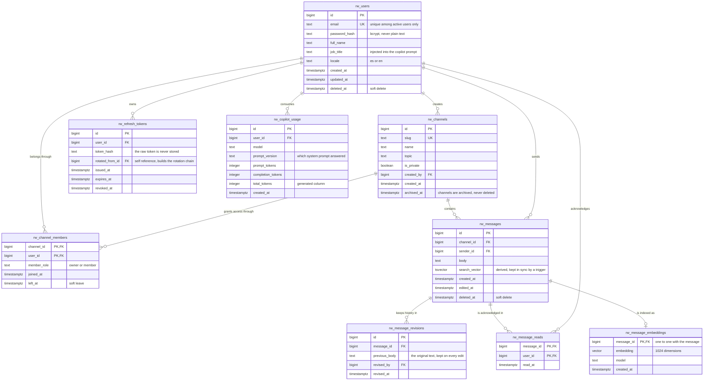

# Data model

Entity relationship model for the Riwi Co. messaging platform, plus the reasoning
behind the key choices and the normalization path from the raw corpus to Third
Normal Form.

No SQL here on purpose. The DDL that implements this model lives in
`db/migrations/001_schema.sql`.

## 1. Entity relationship diagram



> To hand in an image instead of Mermaid, GitHub renders this block directly, or run
> `npx @mermaid-js/mermaid-cli -i docs/ERD.md -o docs/ERD.png`.

## 2. Cardinalities

| Relationship | Cardinality | Reading |
| --- | --- | --- |
| `rw_users` — `rw_channels` (authorship) | 1 : N | one user creates many channels; a channel has exactly one creator |
| `rw_users` — `rw_channels` (membership) | N : M | resolved by `rw_channel_members`; a user belongs to many channels and a channel has many members |
| `rw_channels` — `rw_messages` | 1 : N | every message belongs to exactly one channel |
| `rw_users` — `rw_messages` | 1 : N | every message has exactly one sender |
| `rw_messages` — `rw_message_revisions` | 1 : N | a message accumulates one revision per edit |
| `rw_users` — `rw_messages` | N : M | resolved by `rw_message_reads`; read state per user per message |
| `rw_messages` — `rw_message_embeddings` | 1 : 0..1 | at most one embedding per message; absent until the indexer runs |
| `rw_users` — `rw_refresh_tokens` | 1 : N | a user has many sessions over time |
| `rw_users` — `rw_copilot_usage` | 1 : N | one row per copilot call, for the per user consumption query |

## 3. Primary key choice

**Surrogate key `bigint generated always as identity` for every base entity.**

Reasons, in order of weight for this system:

1. **Keyset pagination needs a monotonic tiebreaker.** The assessment forbids `OFFSET`,
   so the message history paginates on `(created_at, id)`. Two messages can share a
   `created_at` down to the microsecond; a monotonic `id` breaks that tie deterministically
   and keeps the cursor stable. A random `uuid` would order arbitrarily inside the tie and
   could skip or repeat rows across pages.
2. **Index size and locality.** `bigint` is 8 bytes against 16 for `uuid`. `rw_messages`
   carries a composite index `(channel_id, created_at desc, id desc)` and every child table
   references it. Sequential values append to the right edge of the B-tree instead of
   scattering writes across random pages.
3. **The usual argument for `uuid` does not apply here.** `uuid` is normally chosen to stop
   id enumeration. In this system a guessed id is worthless: row level security means the
   row is invisible unless the actor is a member of its channel, and the API never accepts
   a user id from the client. Security lives in RLS, not in key opacity.

**Composite natural keys for the associative tables.** `rw_channel_members` uses
`(channel_id, user_id)` and `rw_message_reads` uses `(message_id, user_id)`.

- Uniqueness comes for free: a user cannot be a member of the same channel twice, or read
  the same message twice, by construction rather than by a separate `UNIQUE` constraint.
- The primary key index is exactly the index the hottest question needs: *is this actor a
  member of this channel?* That check runs inside every RLS policy on every query.
- A surrogate id here would add a column, an index and a uniqueness constraint, and buy
  nothing.

**Identifying key for `rw_message_embeddings`.** Its primary key `message_id` is also its
foreign key. The embedding is not an independent entity; it exists only as a derived
representation of one message, and the shared key enforces the one to one relationship
without any extra constraint.

## 4. Foreign keys and delete behaviour

Physical deletion is forbidden by the assessment, so every user facing removal is a soft
delete (`deleted_at`, `archived_at`, `left_at`). The `ON DELETE` clauses below are therefore
a **second line of defence**: they describe what the database should do if someone ever
bypasses the application and issues a real `DELETE`. That is exactly why `RESTRICT` appears
wherever losing the row would mean losing business evidence.

| Foreign key | Action | Why |
| --- | --- | --- |
| `rw_channel_members.channel_id` → `rw_channels` | `CASCADE` | a membership is meaningless without its channel; it carries no independent information |
| `rw_channel_members.user_id` → `rw_users` | `CASCADE` | same reasoning from the other side |
| `rw_messages.channel_id` → `rw_channels` | `RESTRICT` | deleting a channel must never silently destroy its conversation history; channels are archived instead |
| `rw_messages.sender_id` → `rw_users` | `RESTRICT` | authorship must stay attributable; users are deactivated, not removed |
| `rw_message_revisions.message_id` → `rw_messages` | `CASCADE` | a revision is a weak entity, a part of its message |
| `rw_message_revisions.revised_by` → `rw_users` | `RESTRICT` | the audit trail must keep pointing at a real actor |
| `rw_message_reads.message_id` → `rw_messages` | `CASCADE` | a read receipt for a nonexistent message is noise |
| `rw_message_reads.user_id` → `rw_users` | `CASCADE` | same |
| `rw_message_embeddings.message_id` → `rw_messages` | `CASCADE` | derived data, fully rebuildable from `body` by rerunning the indexer |
| `rw_channels.created_by` → `rw_users` | `RESTRICT` | ownership of a channel is business information |
| `rw_refresh_tokens.user_id` → `rw_users` | `CASCADE` | sessions belong to the user and must die with the account |
| `rw_refresh_tokens.rotated_from_id` → `rw_refresh_tokens` | `SET NULL` | self reference; pruning old links must not break the chain that is still active |
| `rw_copilot_usage.user_id` → `rw_users` | `RESTRICT` | consumption is an accounting record; it has to outlive the account |

## 5. Normalization

The starting point is the flat corpus in `db/seed.json`, the shape a business analyst would
hand over: one row per message, with everything about it repeated inline.

```
message_id | channel_name | channel_is_private | sender_email | sender_full_name |
sender_job_title | body | sent_at | read_by (list) | channel_members (list)
```

### First Normal Form — remove repeating groups

`read_by` and `channel_members` hold comma separated lists of emails. A list inside a cell
cannot be indexed, constrained or joined; asking "who has read message 42" means parsing a
string.

Each list becomes its own row set:

- `channel_members` → **`rw_channel_members`**, one row per `(channel, user)`.
- `read_by` → **`rw_message_reads`**, one row per `(message, reader)`.

Every remaining attribute now holds a single atomic value.

### Second Normal Form — remove partial dependencies

`rw_message_reads` has the composite key `(message_id, user_id)`. Carrying `body` and
`sent_at` along in that table would make them depend on **part** of the key (`message_id`)
and not on the whole of it. Concretely: a message read by five people would store its body
five times, and editing it would require five consistent updates — the classic update
anomaly.

Those attributes move to **`rw_messages`**, keyed by `message_id` alone. `rw_message_reads`
keeps only `read_at`, which genuinely depends on the full key: *when did this user read
this message*.

The same reasoning applies to `rw_channel_members`, which keeps only `member_role`,
`joined_at` and `left_at`.

### Third Normal Form — remove transitive dependencies

This is the step worth pointing at. Inside `rw_messages` the chain was:

```
message_id → sender_email → sender_full_name, sender_job_title
```

`sender_full_name` and `sender_job_title` depend on the key **through** a non key
attribute. That is a transitive dependency, and it costs three ways: a job title change has
to be rewritten across every message that person ever sent, the same person can end up with
two spellings of their name, and someone who has not written yet cannot exist at all.

Those attributes move to **`rw_users`**, and `rw_messages` keeps only `sender_id`.

The identical situation existed for `channel_name → channel_is_private`, resolved by moving
both to **`rw_channels`** and leaving `channel_id` behind.

After this step no non key attribute depends on anything but the whole key.

### Deliberate derived columns

Three columns are computed from data that already exists. They are not a normalization
failure, they are materialized derivations with an explicit mechanism keeping them
consistent:

| Column | Derived from | Kept consistent by |
| --- | --- | --- |
| `rw_messages.search_vector` | `body` | a `BEFORE INSERT OR UPDATE` trigger |
| `rw_message_embeddings.embedding` | `body` | the indexer script, rerunnable at any time |
| `rw_copilot_usage.total_tokens` | `prompt_tokens + completion_tokens` | a generated stored column |

Computing the `tsvector` on every search instead of storing it would make a GIN index
impossible, and the search requirement would degrade to a sequential scan.

## 6. Implicit business rules found in the corpus

These are the rules the model has to enforce, and where each one is enforced. Every one of
them lives in the database, not only in the API.

| Rule | Enforced by |
| --- | --- |
| A user only sees channels where they hold a membership | RLS policy on `rw_channels` |
| A user only sees messages from those channels | RLS policy on `rw_messages` |
| The copilot can only retrieve messages the actor could read directly | the same RLS policy, since retrieval runs as the actor |
| A user cannot post to a channel they do not belong to | `WITH CHECK` on the insert policy plus a membership check in `rw_send_message` |
| A user cannot impersonate another sender | `WITH CHECK (sender_id = rw_current_actor_id())` |
| Only the author edits or deletes their own message | permission check inside `rw_edit_message` and `rw_delete_message` |
| An edit preserves the original text | `rw_message_revisions`, written in the same transaction as the update |
| Messages are never physically removed | `deleted_at`, and no `DELETE` statement anywhere in the code |
| A message body cannot be empty or whitespace only | `CHECK (length(btrim(body)) > 0)` |
| Email is unique among active users, and reusable after deactivation | partial unique index on `lower(email) WHERE deleted_at IS NULL` |
| A message has at most one embedding | the identifying primary key of `rw_message_embeddings` |
| Passwords are never readable | only `password_hash` exists; the column stores a bcrypt digest |
| A refresh token is single use | rotation chain via `rotated_from_id`, plus `revoked_at` |

## 7. What this model deliberately does not do

- **No per message delivery status column.** The `pending / sent / failed` states the
  frontend shows are client side states of an optimistic send. A message only reaches the
  database once it has succeeded, so persisting `pending` would store a state that can
  never be observed by anyone else. Read state, which *is* shared between users, does live
  in the database.
- **No separate vector store.** Embeddings sit in `rw_message_embeddings` inside the same
  PostgreSQL instance. That is what makes the copilot inherit row level security for free:
  retrieval is an ordinary query, subject to the same policies as reading the message.
